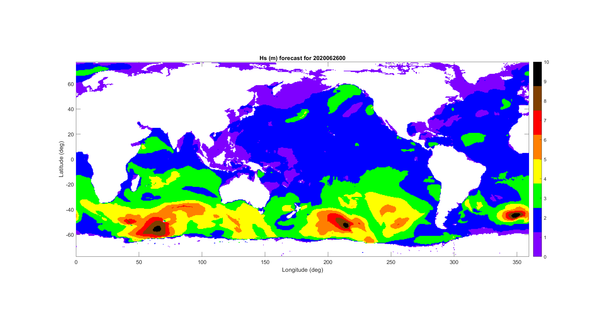

# PrideColormap
 Colormap for Octave and Matlab based on the pride flag

## Background

 On June 26, 2015, the Supreme Court of the United States ruled to make same-sex marriage legal. After the U.S. Supreme Court made this ruling, President Obama stated: “This decision affirms what millions of Americans already believe in their hearts: When all Americans are treated as equal, we are all more free.”
 
 The pride colomap was created to commemmorate this significant step towards equality and to be a constant reminder that the scientific community and its results are part of the society and should guide us to a brighter future. 

 The colormap is according to the recommendations of the American Meteorological Society MPS Subcommittee for Color Guidelines, as published in AMS (1993). A very similar colormap is already used at the operational visualizations [link](https://mag.ncep.noaa.gov/model-guidance-model-parameter.php?group=Model%20Guidance&model=WW3&area=ATL-PAC&ps=area#) 
 
 
 ### Citation
 1993: Guidelines for Using Color to Depict Meteorological Information: MPS Subcommittee for Color Guidelines. Bull. Amer. Meteor. Soc., 74, 1709–1713, https://doi.org/10.1175/1520-0477(1993)074<1709:GFUCTD>2.0.CO;2.	
 
## Use 
 See the instructions and the examples at the top of the pride.m script.
 
 Tested with Octave 5.2 and Matlab 2018a 
 
## Example

 In the figure below, the NCEP forecast of the significant wave height for 2020062600 is used for demonstration. The information about the sea state is clearly depicted.
 
